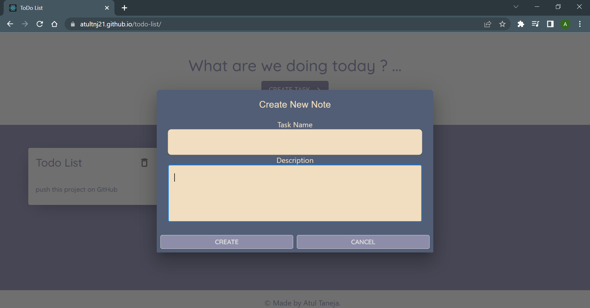
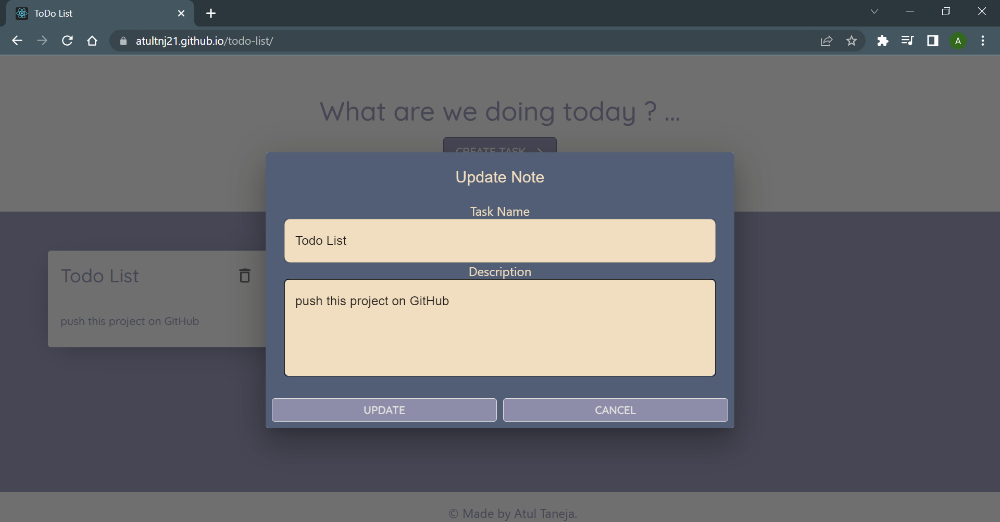
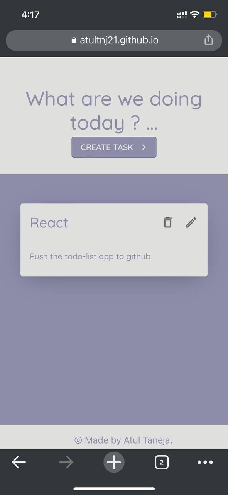
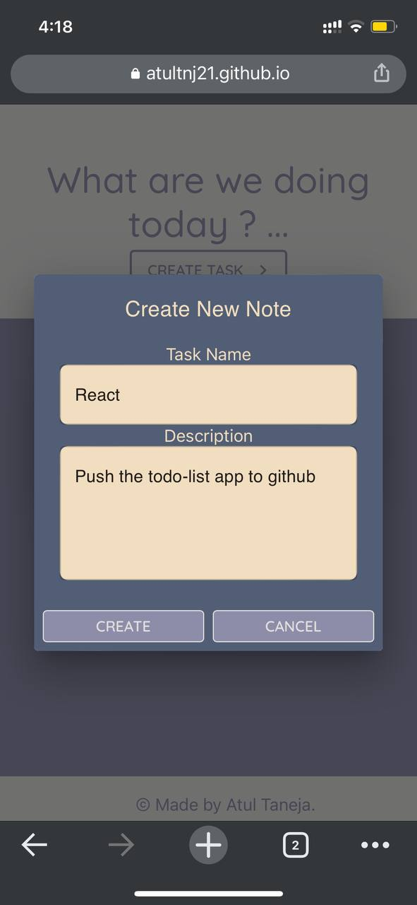

## Developed a todo-list react-app Using Hooks and states in ReactJS

<ul>
<li>NoteCards, Header, Footer, and Create and Edit Task Modals all have **seperate components**.</li>
<li>By supplying Required arguments, you may now dynamically Add, Delete, and Edit Notes.</li>
<li>you cannot create empty new note you have to provide both the feilds(taskName,Description) , otherwise it will not create new note .</li>
</ul>

### Link to view project

[Project Link](https://atultnj21.github.io/todo-list)

### desktop view

#### create new node

#### update node using the edit icon

### mobile view

#### Front page

#### create new node

